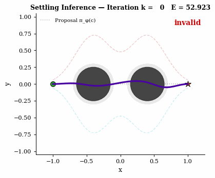

# Settling: Equilibrium Inference for Non-Convex Validity Sets



*Inference-time Settling dynamics: departure from the invalid conditional-mean neighborhood and convergence toward a valid equilibrium.*

Official reproducibility repository for the manuscript:

**Lyes Saad Saoud, “Settling: Equilibrium Inference for Non-Convex Validity Sets.”**

## Overview

This repository contains the code, figures, numerical results, and inference animation for a theoretical and diagnostic study of **conditional mean collapse** and **Settling**, an equilibrium-based inference operator for non-convex validity sets.

Settling treats a mean-seeking prediction as an initialization rather than a terminal output and refines it toward a locally stable, constraint-consistent equilibrium.

## Main quantitative result

For the 100-context geometric diagnostic used in the manuscript:

| Method | Collision-free success | Collision rate | Smoothness | Mean minimum clearance |
|---|---:|---:|---:|---:|
| Mean-seeking aggregate | 0% | 100% | 0.00000 | -0.235 |
| Stochastic denoising | 100% | 0% | 0.02631 | 0.045 |
| Direct energy descent | 0% | 100% | 0.03022 | -0.178 |
| **Settling** | **99%** | **1%** | **0.00092** | **0.027** |

The single nominal Settling failure has minimum clearance 0.01674 under the declared 0.02 clearance threshold.

## 1,200-run robustness sweep

The robustness evaluation uses 100 trials at each sweep point.

- Obstacle-jitter ranges `0.00, 0.04, 0.08, 0.12, 0.16, 0.20` produce Settling success counts of `100, 100, 99, 99, 97, 98` out of 100.
- Initialization perturbations `0.05, 0.10, 0.20, 0.30, 0.40, 0.50` produce success counts of `100, 100, 100, 99, 94, 94` out of 100.

The raw summaries are in `results/`.

## Repository structure

```text
Settling-Equilibrium-Inference/
├── README.md
├── requirements.txt
├── code/
│   ├── environment.py
│   ├── energy.py
│   ├── inference.py
│   ├── evaluation.py
│   ├── figures.py
│   ├── figures_pr.py
│   ├── animation.py
│   ├── run_all.py
│   ├── generate_updated_geometric_figures.py
│   ├── generate_figure7_semantic_reference.py
│   └── settling_robustness_sweep_reproducible.py
├── figures/
│   └── settling_animation.gif
├── results/
└── paper/
```

## Environment

The final reported sweep was reproduced with:

- Python 3.13.5
- NumPy 2.3.5
- SciPy 1.17.0
- Matplotlib 3.10.8

Install dependencies with:

```bash
python -m pip install -r requirements.txt
```

## Reproduce the main code-generated figures

From the repository root:

```bash
cd code
python generate_updated_geometric_figures.py
```

## Reproduce the robustness sweep

From the repository root:

```bash
python code/settling_robustness_sweep_reproducible.py --n 100 --code-dir code
```

The robustness script verifies the vectorized finite-difference implementation against the original gradient implementation before running the sweep.

## Inference animation

The animation displayed at the top of this README is stored at `figures/settling_animation.gif` and visualizes inference-time departure from the invalid conditional-mean neighborhood and convergence toward a valid equilibrium.

## Evidence scope

The quantitative reproducibility claims concern the analytic geometric diagnostic and the code-generated robustness experiments. The semantic and sensor-fusion panels included in the paper are mechanism illustrations and are not presented as learned benchmark evidence.

## Repository

https://github.com/LyesSaadSaoud/Settling-Equilibrium-Inference

## Author

**Lyes Saad Saoud**

## Citation

The formal citation will be updated after publication. Until then, please cite the manuscript title and this repository.
